##  Introduction

Welcome to the documentation for our project that involves scraping data from Coin MarketCap, importing it into a database using SQLAlchemy, performing statistical analysis on the collected data, and finally presenting the results in Power BI. This project aims to provide valuable insights into cryptocurrency market data, enabling us to make informed decisions and gain a deeper understanding of market trends.

## Objectives

The primary objective of this project is to create a streamlined data pipeline for collecting, storing, analyzing, and visualizing cryptocurrency market data. By following this documentation, you will learn how to:

1. Scrape Data from Coin MarketCap: We will guide you through the process of web scraping using Python libraries to extract cryptocurrency data from the Coin MarketCap website.

2. Database Integration with SQLAlchemy: Learn how to set up and configure a SQL database using SQLAlchemy to store the scraped data efficiently.

3. Statistical Analysis: Explore various statistical techniques and tools to gain insights into the cryptocurrency market, including trends, correlations, and key performance indicators (KPIs).

4. Power BI Integration: Finally, we will show you how to connect your database to Power BI for creating interactive dashboards and visualizations to effectively communicate the insights derived from the data.

### Data Scraping

In this section, we will walk you through the process of scraping cryptocurrency data from Coin MarketCap using Python and Selenium. We assume that you have already set up the required environment and libraries as mentioned in the introduction.

1. We present a Python script for web scraping the top 200 cryptocurrency data from the Coin MarketCap website. The scraped data includes information about the rank, name, symbol, circulating supply, and historical data link for each cryptocurrency. This data can be valuable for various purposes, including market analysis, research, and tracking cryptocurrency trends.
2. We have developed a Python script for scraping historical cryptocurrency data from Coin MarketCap. This script allows us to collect historical price and market data for a list of cryptocurrencies over a specified period. The scraped data is saved as CSV files, which can be used for further analysis, visualization, and research.
3. Now we expand our web scraping efforts to collect GitHub information, programming languages used in cryptocurrency projects, and associated tags for each coin. This information can be valuable for analyzing the development activity, technology stacks, and categorization of cryptocurrencies. We will follow a step-by-step approach to extract this data.

### Database Intgration
Introduction
In this phase of the project, we will focus on leveraging SQLAlchemy, a Python library for SQL databases, to create models and tables that will store the cryptocurrency data we have scraped. Additionally, we will demonstrate how to insert the collected data into these database tables. This process allows us to persistently store and manage the cryptocurrency data for future analysis and reporting.

Code Overview
The code can be divided into several key steps:

1. Database Configuration
Database Setup: We define the database connection string, including the database type (e.g., SQLite, MySQL, PostgreSQL) and connection parameters.
Creating a SQLAlchemy Engine: We create an SQLAlchemy engine object that establishes a connection to the database.
2. Defining Models
Model Classes: We define Python classes that represent the data structures we want to store in the database. In our case, these classes represent cryptocurrencies, GitHub information, programming languages, and tags.
Mapping Classes to Tables: We use SQLAlchemy's Object-Relational Mapping (ORM) capabilities to map the model classes to corresponding database tables.
3. Creating Tables
Table Creation: We execute commands to create the necessary tables in the database based on the defined model classes. Each table corresponds to a type of cryptocurrency data, such as coin details, GitHub information, programming languages, and tags.
4. Inserting Data
Data Insertion: We insert data from the scraped CSV files into the corresponding database tables. This involves iterating through the data, creating instances of the model classes, and adding them to the session for later commit.

### Statistical Analysis

This document presents a statistical analysis of average volume data for cryptocurrencies. The analysis includes calculating descriptive statistics such as mean and standard deviation, generating random samples, and visualizing the distribution of average volume values using a histogram.

#### Analysis Steps
1. Data Preparation
The analysis begins with data preparation. The average volume data for cryptocurrencies is loaded into a NumPy array named average_volume_cur. This array contains the average volume values for multiple cryptocurrencies.

2. Descriptive Statistics

    - Mean Calculation
    The mean of the average volume values is calculated using NumPy's mean function. The mean represents the central tendency of the data, providing insight into the typical average volume of cryptocurrencies.

    - Standard Deviation Calculation
    The standard deviation of the average volume values is computed using NumPy's std function. The standard deviation measures the spread or variability of the data points. A higher standard deviation indicates greater variability in average volume values.

The computed mean and standard deviation are reported as follows:

Mean of Average Volume Currencies: [mean_avg_vol]
Standard Deviation of Average Volume Currencies: [std_avg_vol]

3. Random Sampling
To further explore the dataset, 1000 random samples of 40 data points each are generated. These samples are obtained by randomly selecting data points from average_volume_cur with replacement. This process simulates random samples from the population of average volume values.

For each sample, the mean and standard deviation are calculated and stored in the mean_sample_vol and std_sample_vol arrays, respectively. These sample statistics provide insights into the variability of sample means and standard deviations.

4. Histogram Visualization
A histogram is created using the Seaborn library to visualize the distribution of the average_volume_cur data. The histogram provides a visual representation of how average volume values are distributed among cryptocurrencies.

The x-axis of the histogram represents the average volume values.
The y-axis represents the frequency (number of cryptocurrencies) in each average volume range.
The histogram is divided into 5000 bins to capture the distribution details.
The x-axis limits are set to focus on a specific range of average volume values, from 100,000 to 1,000,000,000.

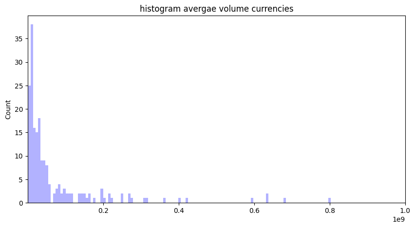

. 
Now we provide a statistical analysis of the mean average volume of random samples taken from a dataset of cryptocurrency average volume values. The analysis includes the generation of random samples, calculation of sample means, and visualization of the distribution of these sample means using a histogram.
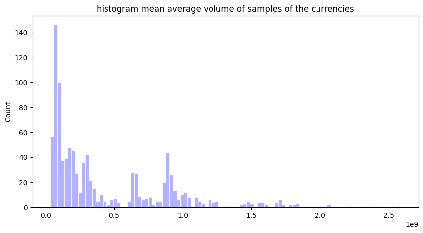
As we can see, the histogram of the average volume 24h of currencies and the average volume 24h samples taken from curencies **does not have a distribution similar to the normal distribution**, so **we cannot use the z-score method** to find confidence interval.Therefore, we use the **bootstrap method**, which **does not require the normality of the data distribution**.

. In bootstarp method, we take many samples from the population and keep the average of all samples. After that, we sort all these averages in ascending order, and among these averages, we select the two averages that 98% of the averages are in the interval between these two averages as the lower bound and the upper bound.
These are the resukt:

Confidence Interval: ( 43370599.979797386 , 1872847876.3255749 )

lower_bound : 43370599.979797386

actual_mean : 446728551.866224
 
upper_bound : 1872847876.3255749

<h3>Hypothesis test 1:</h3>

hypothesis test comparing the price changes of cryptocurrencies between two specific days of the week: Sunday and Thursday. The analysis includes the calculation of summary statistics, such as means and standard deviations, for both groups (Sunday and Thursday), as well as the calculation of a confidence interval for the mean difference.

mean and std of price changes on sunday group   : 0.4199304116238857  -  63.67490067588489

mean and std of price changes on thursday group : 0.1464000495617376  -  61.696591629364626

As we can see, the average of the two populations is almost equal, but their standard deviation is high,
 and we cannot draw a definite conclusion from this comparison. So we use the hypothesis test.

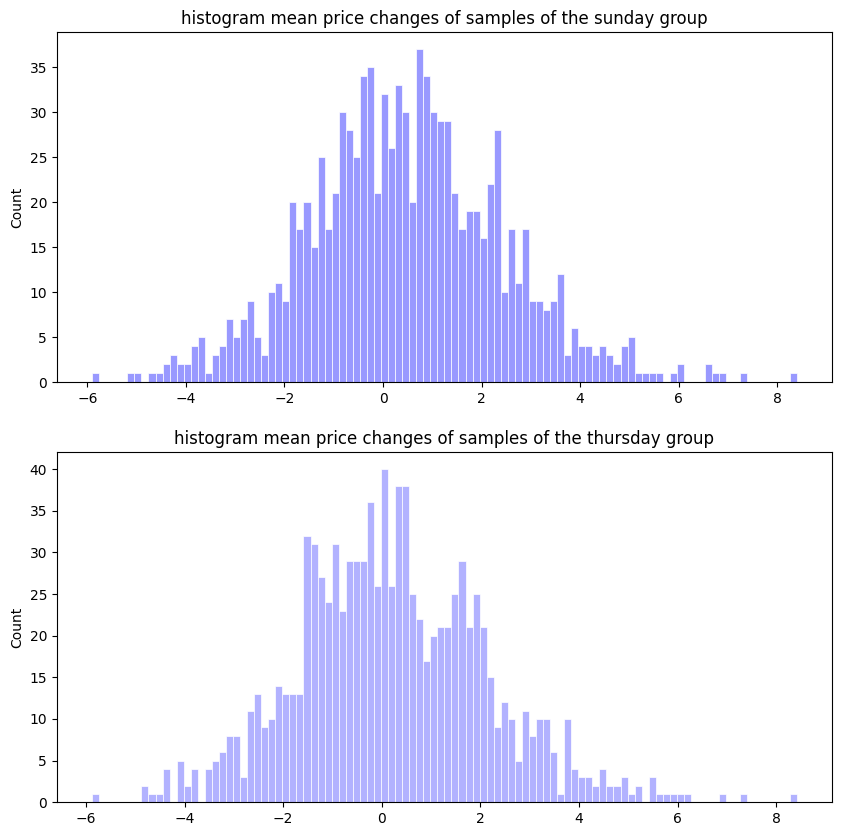 

These two histogram show that the distribution of the average samples of the two populations is almost normal, so we can use the t-test **assuming that the samples observed in the population are independent from each other**. Also, since the currencies are the same in two populations, we use the **paired t-test**.

P-value: 0.43121960671174875

The null hypothesis is that the **expected value of the mean of the two samples is equal**, and considering the value of P, we **cannot reject** this hypothesis.

To use the t test, we assumed that the **samples observed in the two populations are independent of each other**, but we know that in reality this assumption is not correct, for example:  <ul> <li>sharp increase or decrease in the price of currencies with a high market kap affects the entire market.</li> <li>if a currency has a sharp price change in one day, this price change will be effective in the coming days.</li> </ul>
so we use **Wilcoxon signed-rank** test that is non-parametric test and it dosen't require data independency.

P-value: 0.45079243379139866

Same as t-test the null hypothesis is that the **expected value of the mean of the two samples is equal**, and considering the value of P, we **cannot reject** this hypothesis.

<h3>Conclusion:</h3>
Since there was no significant difference between the average price difference in the two groups, it does not matter which working days we choose.

<h3>Hypothesis test 2:</h3>

In hypothesis test 2 comparing the 24-hour trading volumes of two groups of cryptocurrencies: top currencies and stable currencies. The analysis includes the calculation of summary statistics, such as means and standard deviations, for both groups, as well as the calculation of a confidence interval for the mean difference.

mean and std of volume 24h top currencies    : 21653600509.93253   -  16575049003.320984

mean and std of volume 24h stable currencies : 123104793.75706387  -  577794982.0529991

As we can see, the mean of the two populations has a large distance, but the standard deviation of the first population is also extremely high. And we cannot draw a definite conclusion from this comparison. Therefore, we use the hypothesis test.

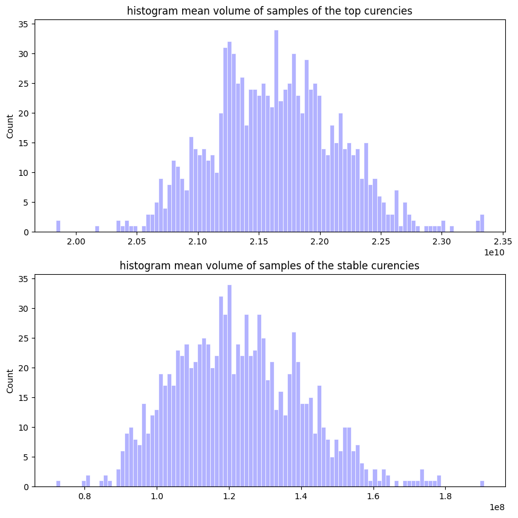

These two histogram show that the distribution of the average samples of the two populations is almost normal, so we can use the t-test, **but the variance of the two populations is far from each other**, so we must use the **Welch t-test**, which does not require the variance of the two populations to be equal.

P-value: 1.3406892290643562e-227

The null hypothesis in this test was that **the expected value of the average of the two populations is the same**, but according to the P value, we **can reject** this assumption.

<h3>Conclusion:</h3>
Since the average of the two populations had a significant difference, the average daily volume of Bitcoin, Ethereum and Tether USDt is much higher than the average daily volume of other cryptocurrencies.

<h3>Hypothesis test 3:</h3>

In this analysis, we explore statistical measures and perform hypothesis test 3 on cryptocurrency data. The dataset used in this analysis contains various attributes related to cryptocurrencies, including average volume, price changes, and trading volume over specific time periods. The goal is to gain insights into the distribution and characteristics of these attributes.

mean and std of price changes on the weekend : 0.16971375140217426  -  41.38663276656512

The mean and standard deviation do not give us information about the distribution of the data :)

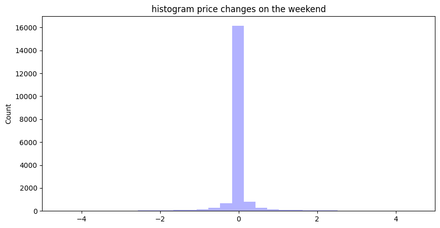

The histogram of the data has a shape similar to the normal distribution, but it's **peak is very high**, and we need to use hypothesis test to know the data distribution is normal or not.

P-value Shapiro-Wilk test : 0.0

P-value Jarque-Bera test  : 0.0

The null hypothesis of both these tests is that **the population has a normal distribution**, but since the p-value is **zero**, the **population does not have a normal distribution**. 
The difference between these two tests is that **Jarque-Bera** test focuses on **skewness and kurtosis**, while **Shapiro-Wilk** test focuses on the **correlation between the observed data and the expected values from a normal distribution**, also **Jarque_Bera** test dose not have any limitation on the sample size but maximum size of sample for **Shapiro-Wilk** test is 5000.

<h3>Hypothesis test 4(Additional):</h3>

**Hossein Ebrahimian** claims that the percentage of using newer and older programming languages in cryptocurrency projects is the same. Now, since he doesn't know anything about statistics, we have to prove his claim. For this purpose, we used 4 programming languages that were released in the **21st** century **(Go 2009, Rast 2015, TypeScript 2012, and Solidity 2014)** and 4 programming languages that were released in the **20th** century **(C 1972, CPP 1985, Java Script 1995, and Python 1991)**.we check the average percentage of use of these 2 groups of programming languages in projects (each of these languages have been used in at least 20 projects.)

mean and std of usage percentage of new top programming languages : 48.48081395348838  -  37.53937984133946

mean and std of usage percentage of old top programming languages : 24.77956989247312  -  29.41003069007837

As we can see, the mean of new langages is greather than old languages, but the standard deviation of the two grops is high.So we cannot draw a definite conclusion from this comparison. Therefore, we use the hypothesis test.

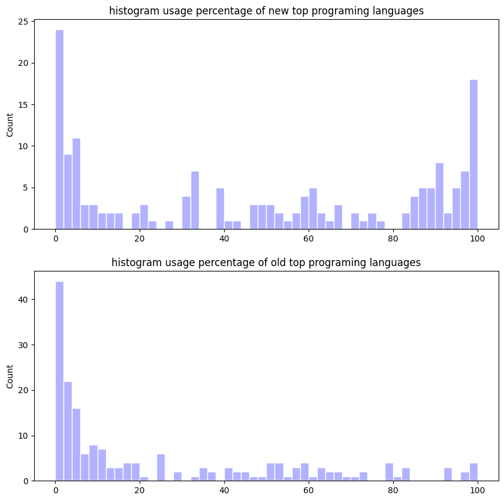

Histograms show that the distribution of both groups is **not normal**

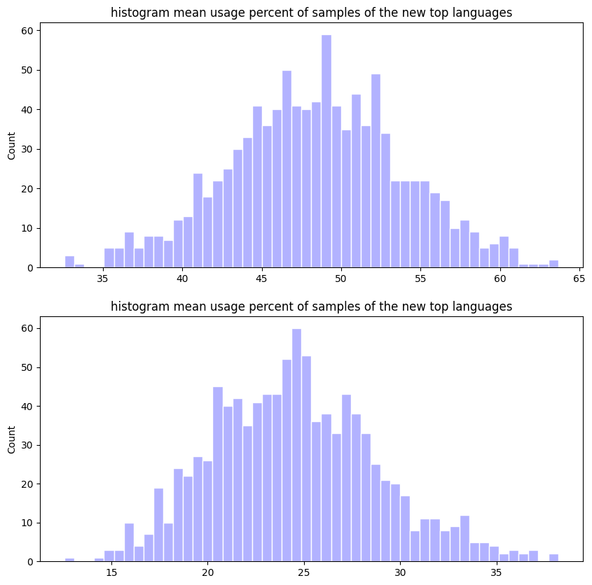

These two histogram show that the distribution of the average samples of the two populations is almost normal, so we can use the t-test, **but the variance of the two populations is not equal**, so we must use the **Welch t-test**, which does not require the variance of the two populations to be equal.

P-value: 2.4413785563638207e-06

The null hypothesis in this test was that **the expected value of the average of the two populations is the same**, but according to the P value, we **can reject** this assumption.Therefore, Hossein's claim was wrong and the average percentage of using new programming languages in cryptocurrency projects is higher.

--------------------------------------------------------------------------------------------------
#### Question 1 :

. In this analysis, we explore the relationship between cryptocurrency market capitalization (marketCap) and trading volume (volume). We aim to visualize this relationship and gain insights into how these two key metrics are related within the cryptocurrency market.

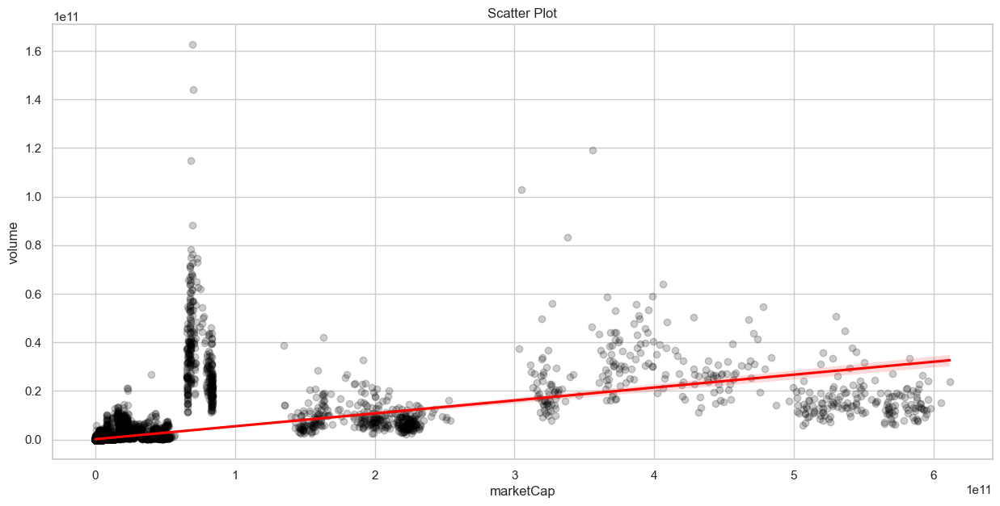

#### Devide the data to 4 parts: 

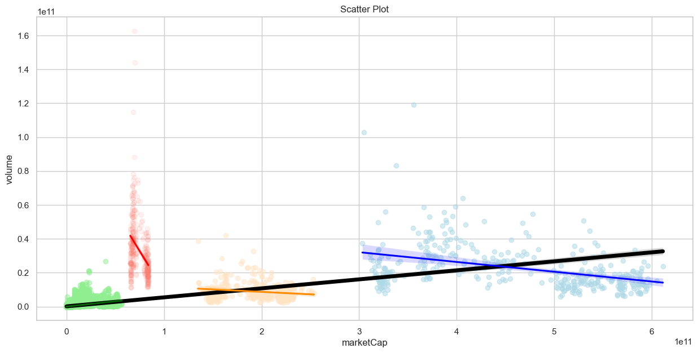

#### Devide the data to 2 parts: 

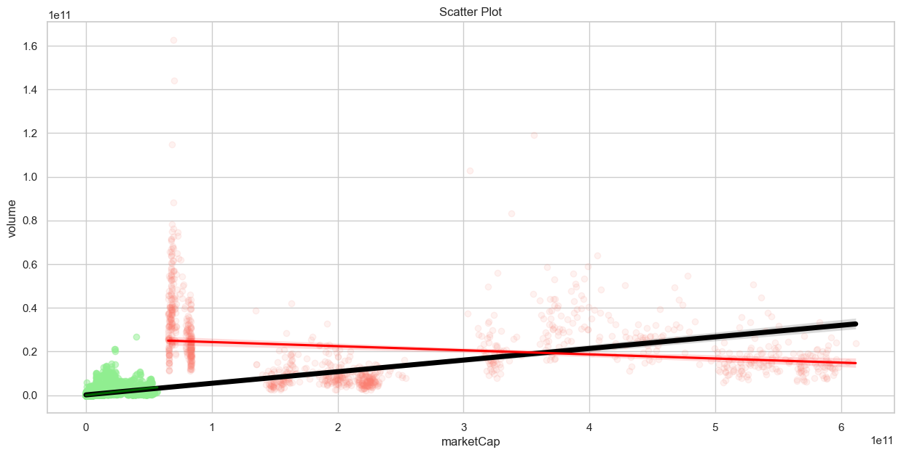

#### Scatter Plot of all Coins in Day: "2023-09-01"

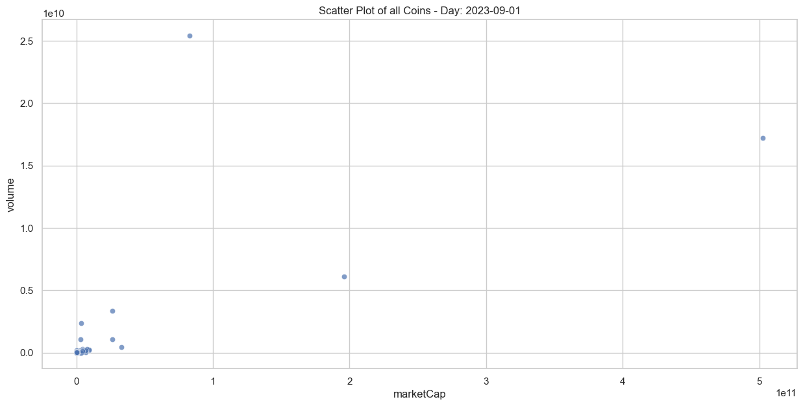

#### Scatter Plot of 3 Best Coins

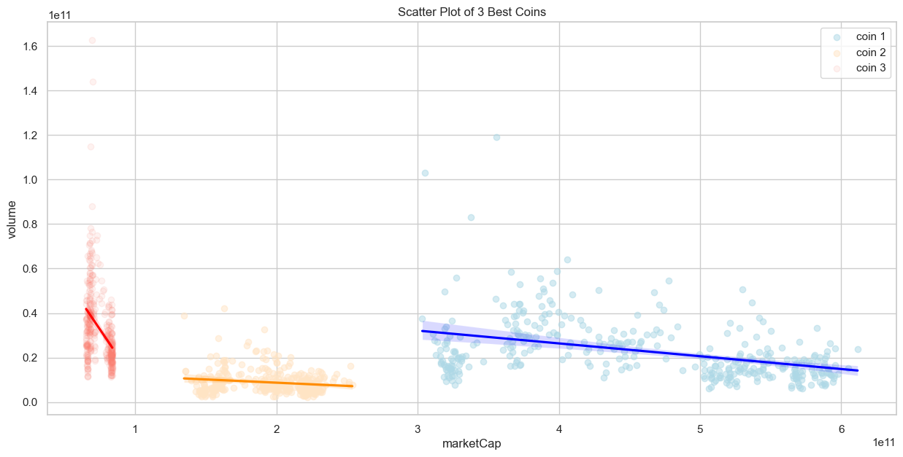

#### Scatter Plot of other 197 Coins

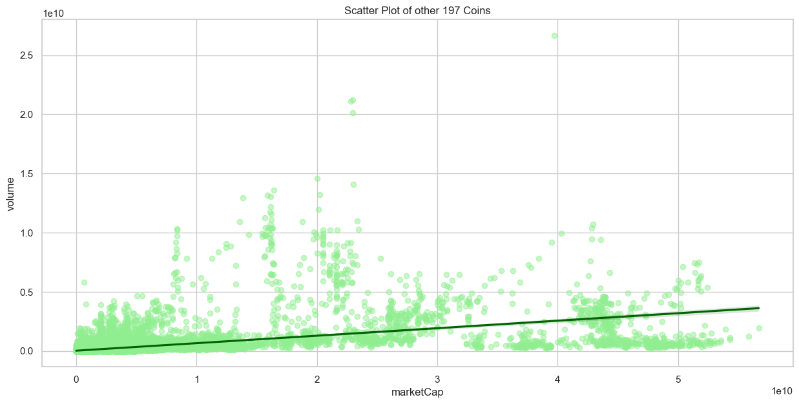

------------------------------------------------------------------------------------------------
#### Question 2 : Coins Correlation

In this analysis, we delve into the world of cryptocurrencies by examining two key aspects:

Price Change Analysis: We analyze the daily price changes of various cryptocurrencies and determine the direction of price changes. This allows us to identify which cryptocurrencies tend to move in the same direction.

Currency Correlation Heatmap: We visualize the correlations between the price movements of the top cryptocurrency pairs with the highest number of days moving in the same direction.

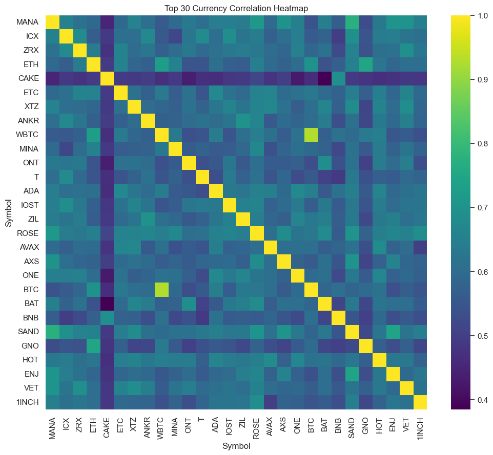

This analysis offers insights into the price dynamics of cryptocurrencies and identifies pairs of cryptocurrencies that often move in the same direction. The correlation heatmap helps visualize the relationships between these pairs, which can be valuable for traders and investors in making informed decisions within the cryptocurrency market.

----------------------------------------------------------------------------------
#### Question 3 :

#### Plot Volume Distribution

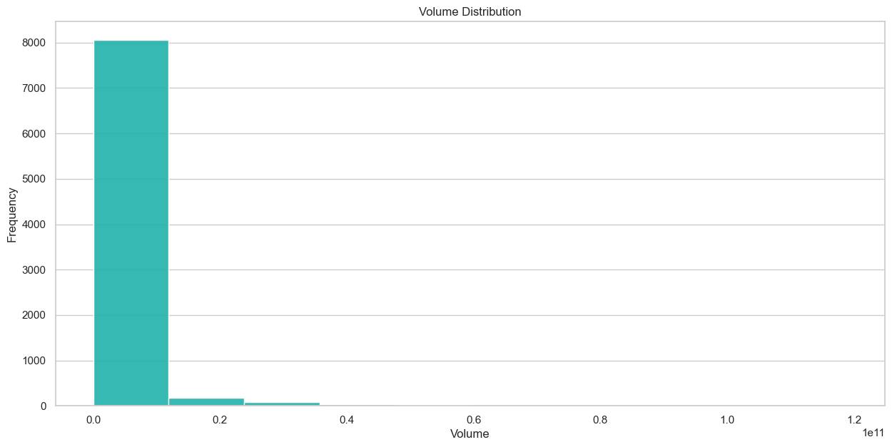

----------------------------------------------------------------------------------

#### Question 4 :

#### Plot Correlation Matrix for all Columns

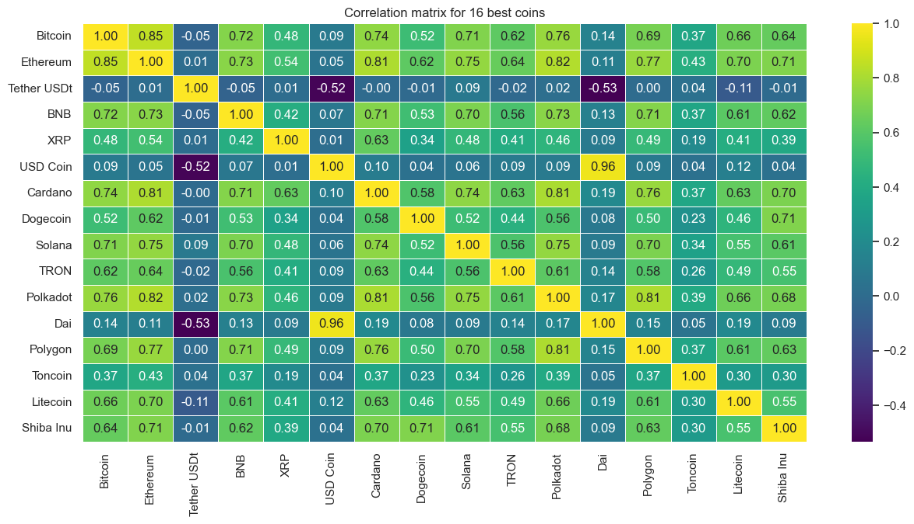

-----------------------------------------------------------------------------------

#### Qestion 5 :

#### Top 10 Coins in Red Days

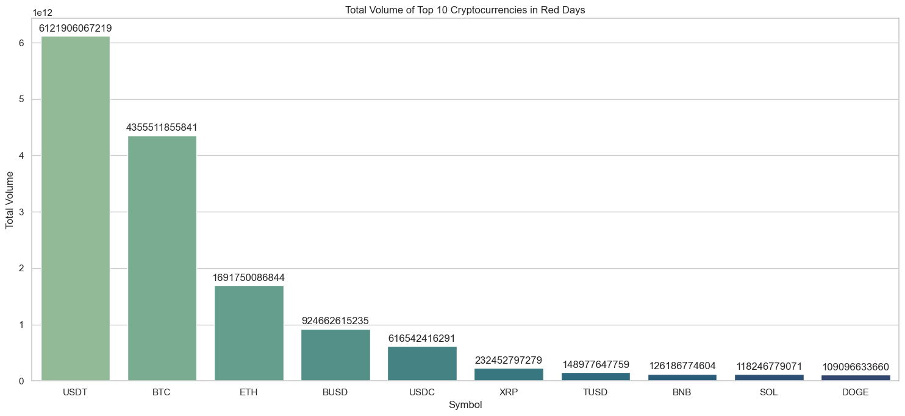

-----------------------------------------------------------------------------------
### Power BI:

#### Introduction
In this section we explore the process of integrating a database containing cryptocurrency data into Power BI, designing a star schema for data modeling, and creating analytical reports and visualizations to gain insights into the cryptocurrency market.

#### Step 1: Database Integration
* Data Source
    * Ensure that you have the necessary credentials and permissions to access the database.
* Data Loading
    * Import data from the database into Power BI. You can use various methods, such as connecting directly to the database, importing CSV files, or using other data connectors.
#### Step 2: Data Modeling with Star Schema
- Understanding the Star Schema
    * Design a star schema data model. In a star schema, data is organized into fact tables and dimension tables.
- Fact Table
    * Create a fact table that contains transaction-level data. 
- Dimension Tables
    * Design dimension tables that provide context to the fact table. 
- Relationships
    * Establish relationships between the fact table and dimension tables. These relationships enable you to slice and dice data efficiently.
- Data Transformation
    * Apply necessary data transformations within Power BI, such as data cleansing, aggregation, and calculated columns, to prepare the data for analysis.
#### Step 3: Creating Analytical Reports
- Data Exploration
    * Start exploring the data using Power BI's data exploration capabilities. Use filters, slicers, and drill-through options to gain insights into the dataset.
- Visualization
    * Create a variety of visualizations to represent cryptocurrency data effectively. Common visualizations include line charts and more.
- Key Performance Indicators (KPIs)
    * Define and display key performance indicators (KPIs) relevant to cryptocurrency trading and investment.
#### Step 4: Dashboard Creation
- Building Dashboards
    * Combine visualizations and KPIs into interactive dashboards. Dashboards provide an overview of cryptocurrency market data and allow users to interact with the data dynamically.

Conclusion
By integrating your cryptocurrency data into Power BI, designing a star schema, and creating insightful reports and dashboards, you can harness the power of data analytics to make informed decisions in the dynamic world of cryptocurrency trading and investment.

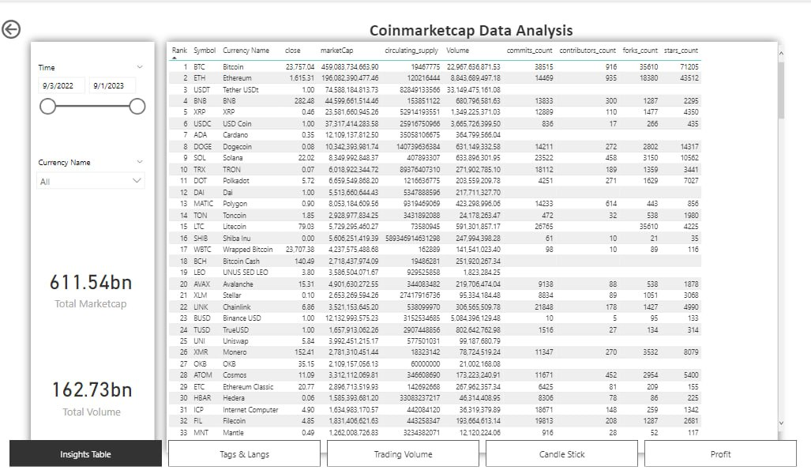

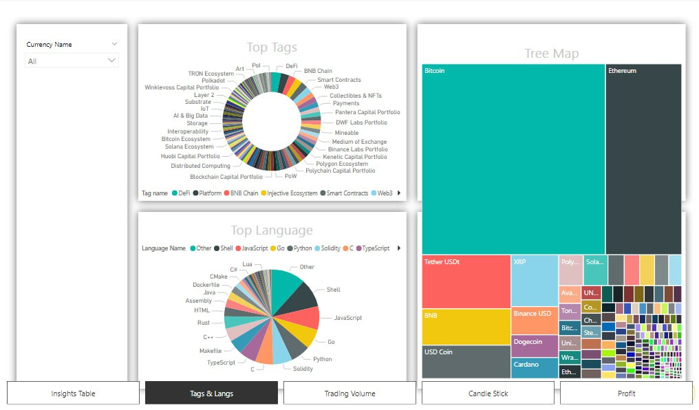

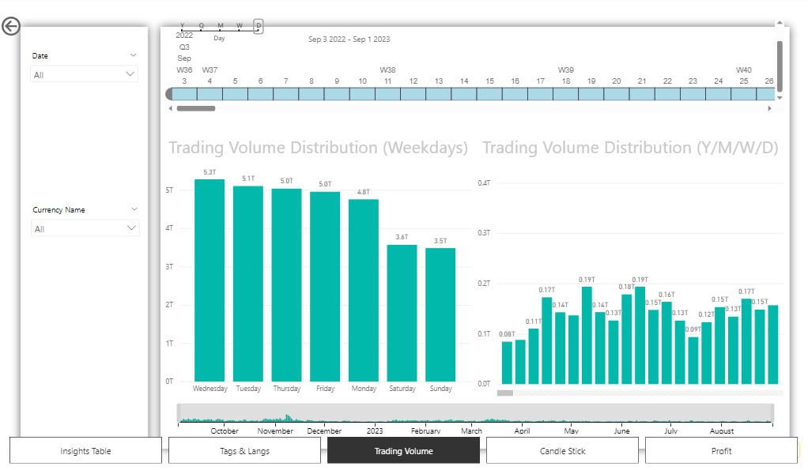

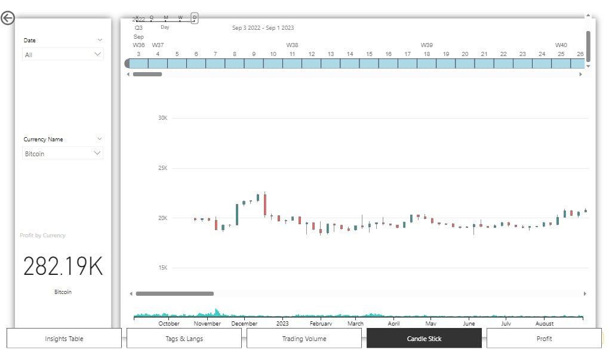

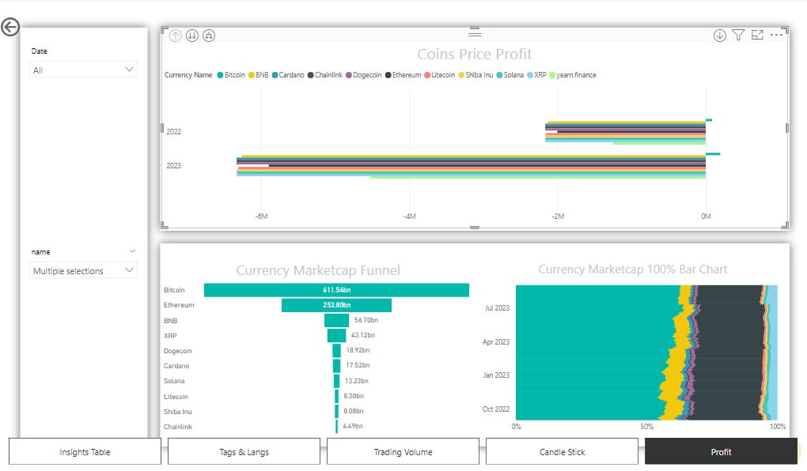
